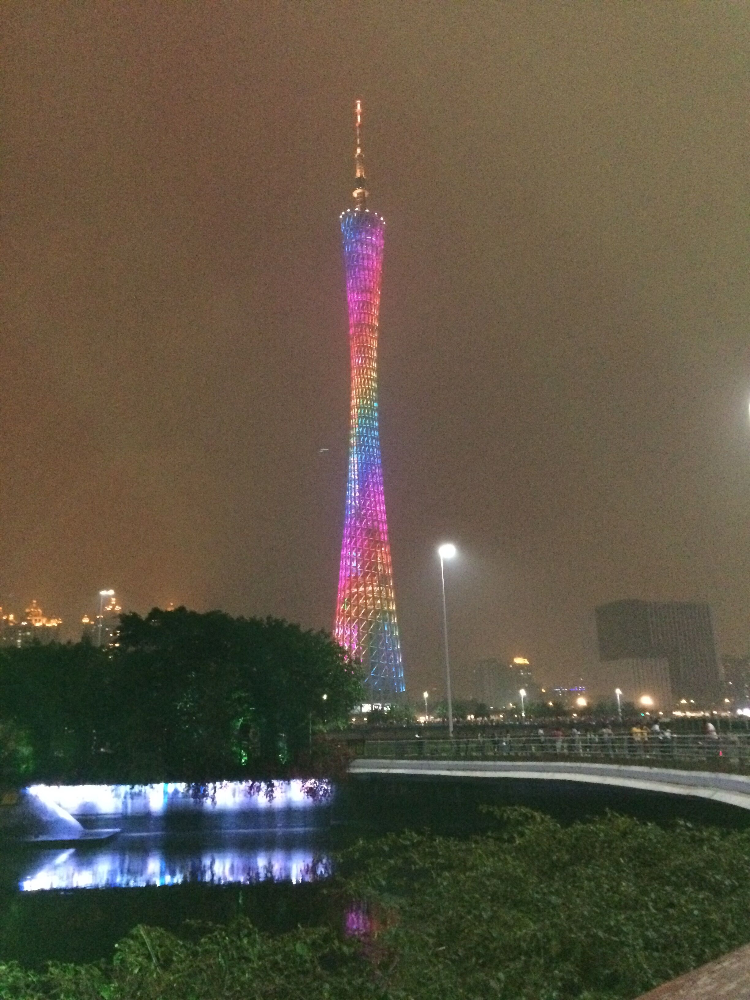

##对待生活
已近年末，从出校园月到社会差不多一年，到上海差不多四个月。小城的安逸舒适，大城的拥挤广阔，各有千秋，各有不同。
每个人的生命历程，冷暖自知，不论什么立场，什么角度，唯一确定的是每个的生命都是独一无二的。unique 但是独一无二并不代表价值，对其他人有影响才是价值的基础，才是价值的本质。所以，lonely guy means nothing even to himself.存在感，如果是一个人，无法判断自己的价值，毫无存在感，你不对周围，或者任何人有影响，从这个角度，毫无一丝存在的意义。

  但生命自有其姿态，一个积极的态度，一次次向着目标努力，言必行，这就是一个很好的生存方式。缓慢的进步是痛感最小的，也是效果明显的。一次又一次的失信于自己，到最后只能自欺欺人。古语有云，冰冻三尺，非一日之寒。欲速则不达，有些能够承受，有些代价却十分高昂。即使即将来临的暴风雨要毁灭一切，但是只要一息尚存，我们仍可以有理想，或者可以称之为奢望。
曾经的【风华正茂】缺乏对事物的认知，空有一腔热血，却没有一个清晰的做事方法，终于流于表面，淹没在记忆中。I don't care what you wanna do.What you have done makes sense.

广州

